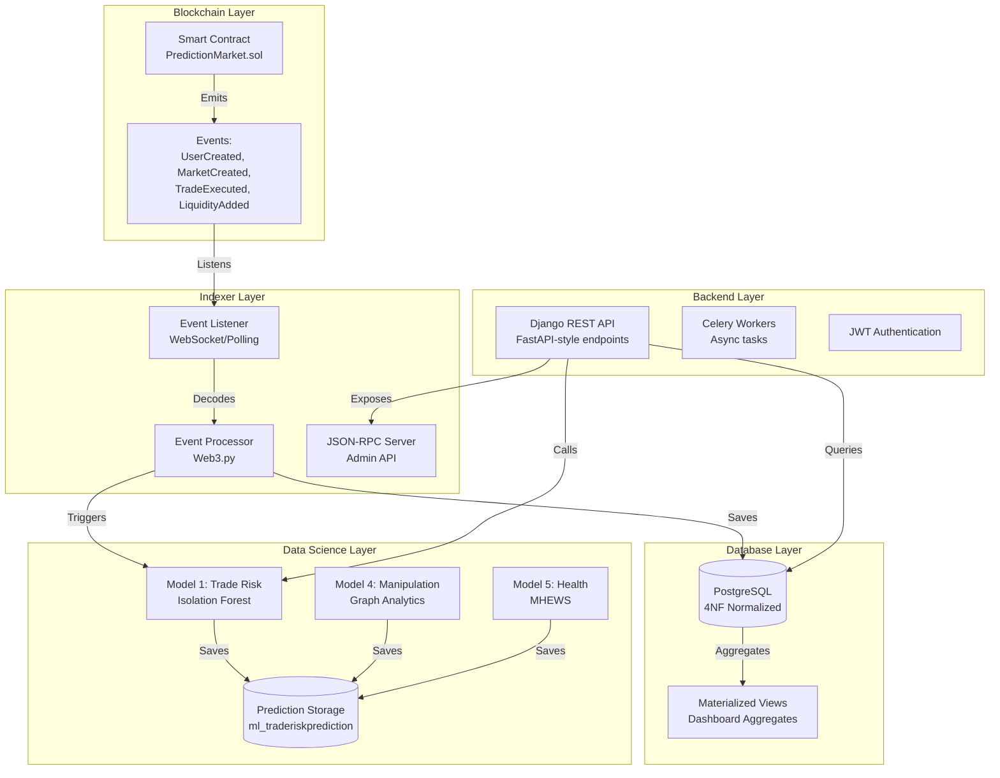

# PredictHub - Decentralized Prediction Market Platform

**SDF2 Build - Production Ready**

A full-stack decentralized prediction market platform integrating Blockchain, Backend, Database, and Data Science components.

[](https://www.djangoproject.com/)
[](https://soliditylang.org/)
[](https://www.postgresql.org/)
[](https://eth-brownie.readthedocs.io/)

---

## 🏗️ Architecture Overview



---

## 📁 Project Structure

```
PredictBack/
├── contracts/                # Solidity contracts & Brownie tests
│   ├── contracts/            # Solidity source files
│   ├── tests/               # Brownie test suite (39 tests)
│   ├── scripts/             # Deployment scripts
│   └── README.md            # Contract documentation
│
├── backend/                 # Django backend
│   ├── indexer/             # Blockchain event indexer
│   ├── markets/             # Market management
│   ├── trades/              # Trading system
│   ├── ml_api/              # ML API endpoints
│   ├── users/               # User management
│   ├── db_docs/             # Database documentation
│   └── README.md            # Backend documentation
│
├── ml/                      # ML models & services (root level)
│   ├── data/                # CSV/synthetic data
│   ├── models/              # Saved .pkl files
│   ├── notebooks/           # Jupyter notebooks
│   └── README.md            # ML documentation
│
├── database/                # Database scripts & SQL
│   ├── sql/                 # SQL scripts
│   └── seeds/               # Seed scripts
│
├── scripts/                 # Utility scripts
├── tests/                   # Consolidated tests
├── docker-compose.yml       # Docker orchestration
├── Dockerfile               # Docker image definition
└── TESTING_GUIDE.md         # Master testing guide
```

---

## 🚀 Quick Start

### Prerequisites

- **Python 3.11+**
- **Node.js 18+** (for Hardhat)
- **PostgreSQL 15+**
- **Redis 7+**
- **Docker & Docker Compose** (optional)
- **Ganache** (for local blockchain testing)

### 1. Clone & Setup

```bash
git clone <repository-url>
cd PredictBack
```

### 2. Start Database (Docker)

```bash
docker-compose up -d db redis
```

### 3. Deploy Smart Contract

```bash
cd contracts
npm install
npx hardhat run scripts/deploy_and_export.js --network localhost
```

### 4. Start Backend & Indexer

```bash
cd backend
python manage.py migrate
python manage.py seed_knowledge_tags
python manage.py runserver
```

In another terminal:
```bash
cd backend
python manage.py listen_events --poll-interval 12
```

### 5. Verify System

```bash
# Run tests
cd contracts
brownie test

cd ../backend
pytest

# Verify ML integration
python manage.py verify_ml_db_integration --test-all
```

---

## 🔗 System Components

### 1. Smart Contracts (`contracts/`)

- **Contract**: `PredictionMarket.sol`
- **Events**: `UserCreated`, `MarketCreated`, `TradeExecuted`, `LiquidityAdded`, `MarketResolved`
- **Testing**: 39 Brownie tests (21 success + 18 error paths)
- **Deployment**: Hardhat script exports ABI to backend

See [`contracts/README.md`](contracts/README.md) for details.

### 2. Backend & Indexer (`backend/`)

- **Framework**: Django 5.2.8 + DRF
- **Indexer**: WebSocket/Polling listener for blockchain events
- **API**: REST endpoints for markets, trades, positions
- **RPC**: JSON-RPC 2.0 server for admin integration

See [`backend/README.md`](backend/README.md) for details.

### 3. Database (`database/` & `backend/db_docs/`)

- **Schema**: 4NF normalized PostgreSQL
- **Tables**: Users, Markets, Trades, Liquidity, KnowledgeTags
- **Views**: Materialized view for dashboard (`market_volume_by_tag`)
- **Migrations**: Django migrations with seed scripts
- **SQL Scripts**: Located in `database/sql/`

See [`backend/db_docs/README.md`](backend/db_docs/README.md) for details.

### 4. Data Science (`ml/`)

- **Model 1**: Trade Risk Detection (Isolation Forest)
- **Model 4**: Market Manipulation (Graph Analytics)
- **Model 5**: Platform Health (MHEWS)
- **Storage**: Predictions saved to `ml_*` tables
- **Data**: Synthetic data in `ml/data/`
- **Notebooks**: Jupyter notebooks in `ml/notebooks/`

See [`ml/README.md`](ml/README.md) for details.

---

## 🔄 Data Flow

### Golden Flow: User Creates Market → Adds Liquidity → Trade Executed

1. **On-Chain**: User calls `createMarket()` → `MarketCreated` event emitted
2. **Indexer**: Listener catches event → Decodes → Processes
3. **Database**: `EventProcessor` saves to `markets_market` table
4. **API**: `/api/markets/` returns new market
5. **ML**: Trade risk model analyzes → Saves to `ml_traderiskprediction`

### Event Processing Flow

```
Blockchain Event → Listener → Decoder → Processor → Database
                                      ↓
                                 ML Models
                                      ↓
                              Prediction Storage
```

---

## 📊 Key Features

- ✅ **Smart Contract Events**: All key actions emit events
- ✅ **Event Indexing**: Automatic sync from blockchain to database
- ✅ **4NF Database**: Normalized schema with materialized views
- ✅ **ML Integration**: 5 models with database storage
- ✅ **Comprehensive Tests**: 39 Brownie tests + Django tests
- ✅ **API Documentation**: Swagger/OpenAPI + GraphQL
- ✅ **RPC Server**: JSON-RPC 2.0 for admin tools

---

## 🧪 Testing

### Smart Contract Tests

```bash
cd contracts
brownie test                    # All 39 tests
brownie test --coverage         # With coverage
```

### Backend Tests

```bash
cd backend
pytest                          # All tests
pytest tests/test_api.py        # API tests
```

### Integration Verification

```bash
cd backend
python manage.py verify_ml_db_integration --test-all
```

**See [`TESTING_GUIDE.md`](TESTING_GUIDE.md) for complete manual testing workflow.**

---

## 📚 Documentation

- **Root**: This file (architecture & quick start)
- **Backend**: [`backend/README.md`](backend/README.md)
- **Contracts**: [`contracts/README.md`](contracts/README.md)
- **Database**: [`backend/db_docs/README.md`](backend/db_docs/README.md)
- **ML**: [`ml/README.md`](ml/README.md)
- **Testing**: [`TESTING_GUIDE.md`](TESTING_GUIDE.md)

---

## 🔧 Environment Variables

### Backend (`.env`)

```bash
SECRET_KEY=your-secret-key
DEBUG=True
POSTGRES_DB=predicthub_db
POSTGRES_USER=postgres
POSTGRES_PASSWORD=postgres
POSTGRES_HOST=localhost
POSTGRES_PORT=5432
CELERY_BROKER_URL=redis://localhost:6379/0
WEB3_PROVIDER_URL=http://localhost:8545
CONTRACT_ADDRESS=0x...
```

### Smart Contracts (`.env`)

```bash
PRIVATE_KEY=your-private-key
WEB3_INFURA_PROJECT_ID=your-infura-id
```

---

## 🐳 Docker Deployment

```bash
docker-compose up -d
```

Services:
- **web**: Django server (port 8000)
- **db**: PostgreSQL (port 5432)
- **redis**: Redis (port 6379)
- **celery**: Celery worker
- **celery-beat**: Celery scheduler
- **indexer**: Event listener

**Note**: Docker files are at the root level. The build context includes `backend/` and `ml/` directories.

---

## 📈 API Endpoints

### Core Endpoints

- `GET /api/markets/` - List markets
- `POST /api/markets/{id}/trade/` - Place trade
- `GET /api/trades/` - List trades
- `GET /api/indexer/rpc/` - JSON-RPC endpoint

### ML Endpoints

- `POST /api/ml/risk/predict/` - Predict trade risk
- `GET /api/ml/health/` - Platform health status
- `GET /api/ml/manipulation/market/{id}/` - Manipulation analysis

### Documentation

- `GET /swagger/` - Swagger UI
- `GET /redoc/` - ReDoc
- `GET /graphql/` - GraphQL Playground

---

## 🔍 Monitoring

### Indexer Status

```bash
# Via Django admin
http://localhost:8000/admin/indexer/recent-events/

# Via JSON-RPC
curl -X POST http://localhost:8000/api/indexer/rpc/ \
  -H "Content-Type: application/json" \
  -d '{"jsonrpc":"2.0","method":"get_indexer_status","params":{},"id":1}'
```

### Database Queries

```sql
-- Check indexed events
SELECT COUNT(*) FROM indexer_onchaineventlog;

-- Check ML predictions
SELECT COUNT(*) FROM ml_traderiskprediction;

-- Check materialized view
SELECT * FROM market_volume_by_tag;
```

---

## 🛠️ Development

### Adding New Events

1. Add event to `contracts/contracts/PredictionMarket.sol`
2. Update `EventProcessor` in `backend/indexer/services.py`
3. Add test in `contracts/tests/`
4. Run migrations if new DB fields needed

### Adding New ML Models

1. Create model file in `ml/`
2. Add service in `ml/services/`
3. Create API endpoint in `backend/ml_api/views.py`
4. Add DB model in `ml/models.py` (if using Django models)
5. Run migrations from `backend/` directory

---

## 📝 License

BSD License

---

## 🤝 Support

- **API Docs**: http://localhost:8000/swagger/
- **Admin Panel**: http://localhost:8000/admin/
- **Testing Guide**: See `TESTING_GUIDE.md`

---

## ✅ SDF2 Requirements Status

- ✅ Smart Contract with events (`UserCreated`, `LiquidityAdded`, `TransactionCreated`)
- ✅ ≥10 Brownie tests (39 tests total)
- ✅ 4NF Database schema
- ✅ Materialized view for dashboard
- ✅ Indexer with event listener
- ✅ API endpoints (`/api/history`, `/api/user/{id}`)
- ✅ JSON-RPC server
- ✅ ML models with DB integration
- ✅ Docker Compose setup

**All requirements met!** 🎉
